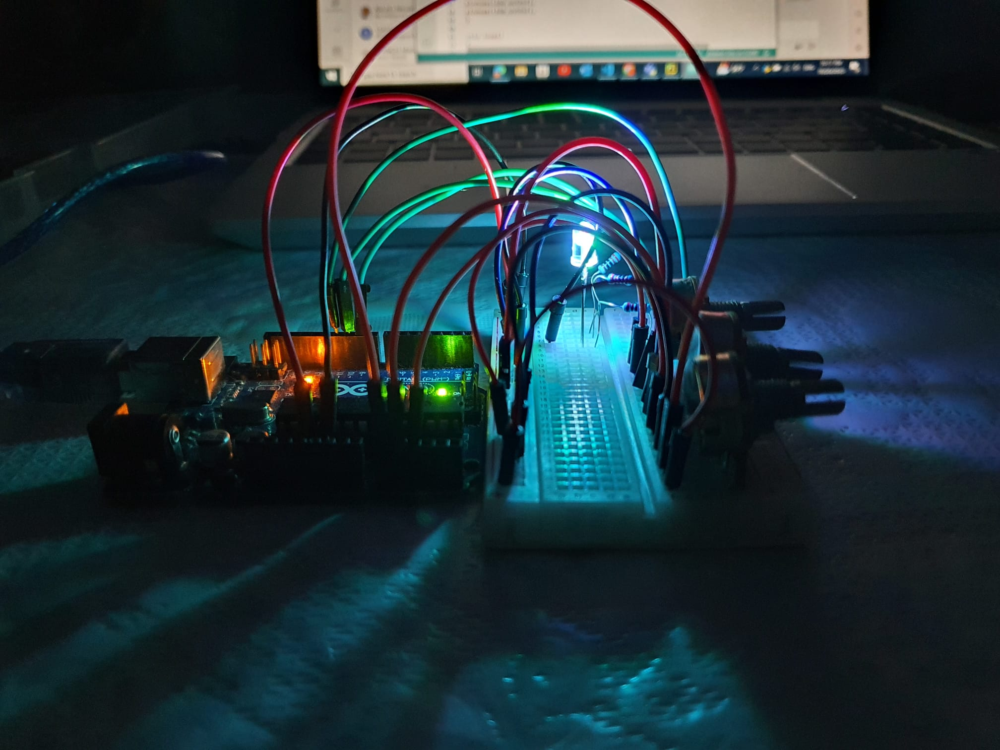
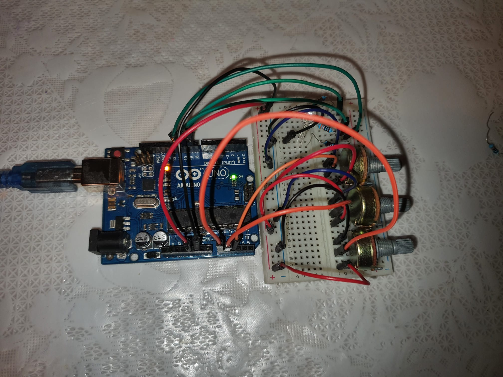
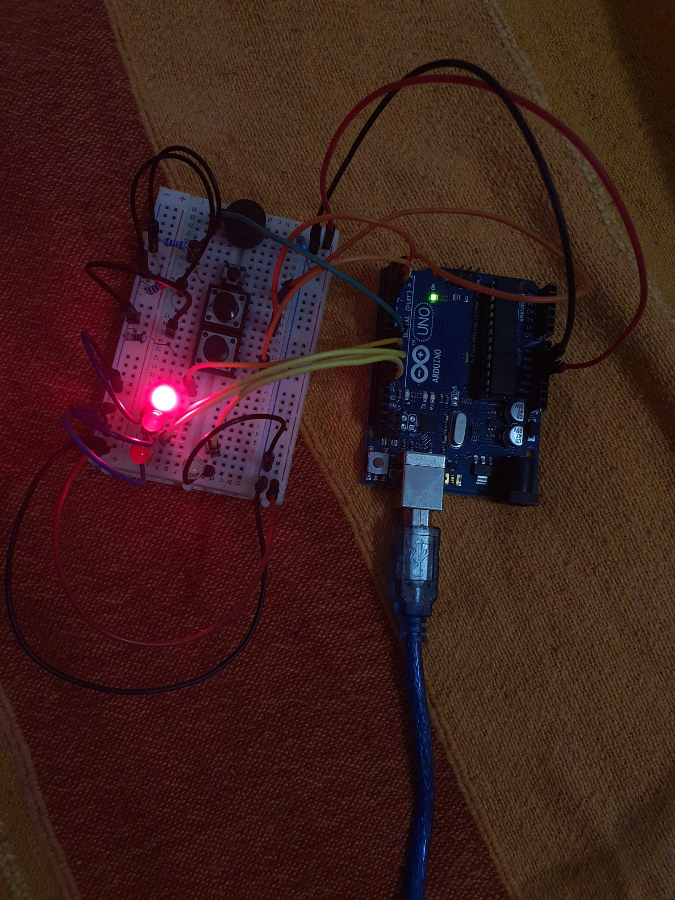
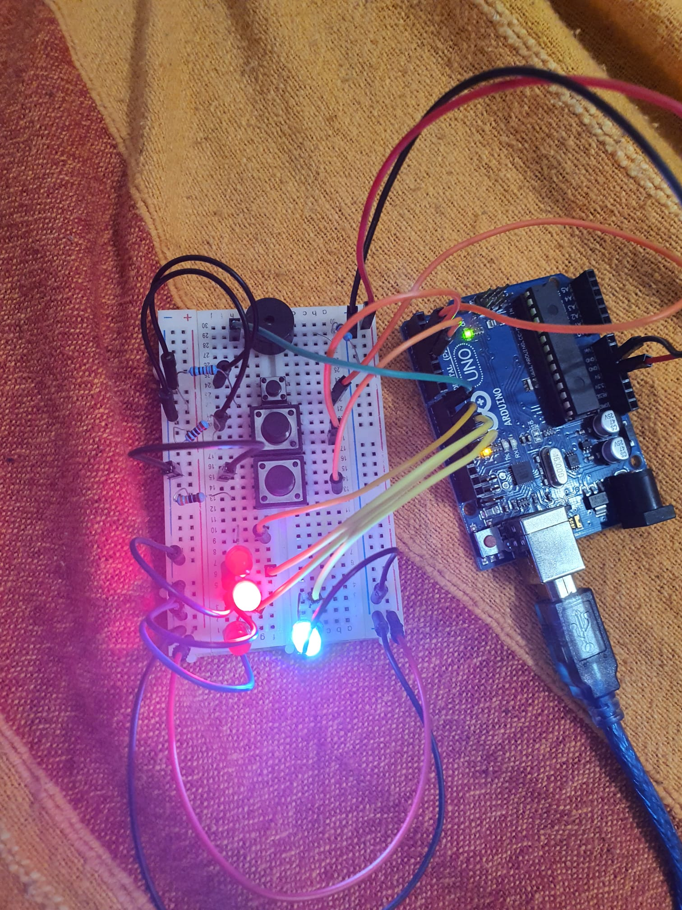

# Introduction to Robotics

## Descriere

Acest repository conține informații și temele de la robotică. Pentru teme vor fi adaugate mai multe informatii: 
- requirements
- detalii despre tema
- materiale foto/video
- cod

Mai jos veți găsi o mică glumă pentru a vă amuza!

## Glumă

Într-un bar se aduce un robot pe post de barman. Vine un client, se aşează la tejghea, robotul îi serveşte băutura şi îl întreabă:
– Ce IQ aveți?
– 150…
Și robotul continuă conversaţia despre fizica cuantică, tehnologii medicale avansate şi alte subiecte care necesită un grad ridicat de cunoştinţe şi înţelegere.  Impresionat, clientul iese din bar, stă două minute şi intră iar. La fel, îl preia robotul şi răspunde acestuia:
– 100…
Și robotul continuă discuţia despre celebre meciuri de box, renumite fabrici de bere şi altele de același tip uzual. Clientul mai încearcă o dată faza, iese afară, intră şi este întâmpinat de robot:
– Ce IQ aveți?
– 50…
– Și… tot fericit că l-ai votat pe Băsescu?

## Alte glume despre roboți

- Cum numești un robot care se lovește mereu de pereți?
  - Wall-E.
- Ce fac roboții câini?
  - Ei byte.
- Ce se întâmplă cu roboții după ce aceștia dispar?
  - Ruginesc în pace.
- Care este trupa preferată a unui robot?
  - Fețe metalice
- De ce a traversat puiul robot drumul?
  - El a fost programat așa.

## Homework 1

[Vizualizare ](https://youtu.be/1N3irRfwCFM)

### Components
- RGB LED (At least 1)
- Potentiometers (At least 3)
- Resistors and wires as needed

### Description
Use a separate potentiometer for controlling each color of the RGB LED: Red, Green, and Blue. This control must leverage digital electronics. Specifically, you need to read the potentiometer’s value with Arduino and then write a mapped value to the LED pins.

 

## Homework 2

[Vizualizare ](https://youtube.com/shorts/hmYTQVivXF4?feature=share)

### Components
-  LEDs (At least 4: 3 for the floors and 1 for the elevator’s operational
state)
- Buttons (At least 3 for floor calls)
- Buzzer (1) - optional for Computer Science, mandatory for CTI
- Resistors and wires as needed

### Description
Design  a  control  system  that  simulates  a  3-floor  elevator  using  the  Arduino platform.  

Here are the specific requirements:

• LED Indicators: Each of the 3 LEDs should represent one of the 3 floors.The LED corresponding to the current floor should light up.  Additionally,another LED should represent the elevator’s operational state.  It should blink when the elevator is moving and remain static when stationary.

• Buttons:Implement 3 buttons that represent the call buttons from the 3 floors.  When pressed, the elevator should simulate movement towards the floor after a short interval (2-3 seconds).

• Buzzer  (optional  for  Computer  Science,  mandatory  for  CTI):The buzzer should sound briefly during the following scenarios:
  – Elevator arriving at the desired floor (something resembling a ”cling”).
  – Elevator  doors  closing  and  movement  (pro  tip:  split  them  into  2different sounds)
  
• State Change & Timers:If the elevator is already at the desired floor,pressing the button for that floor should have no effect.  Otherwise, aftera button press, the elevator should ”wait for the doors to close” and then ”move”  to  the  corresponding  floor.   If  the  elevator  is  in  movement,  it should either do nothing or it should stack its decision (get to the firstprogrammed floor,  open the doors,  wait,  close them and then go to the next desired floor).

• Debounce:Remember to implement debounce for the buttons to avoidu intentional repeated button presses.

 
