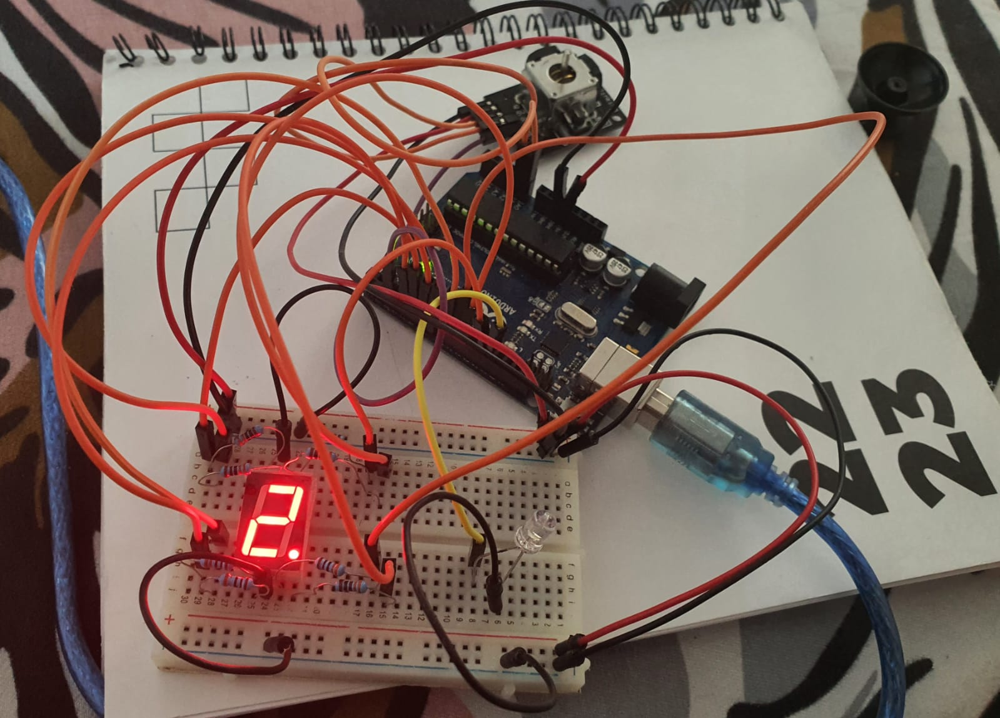
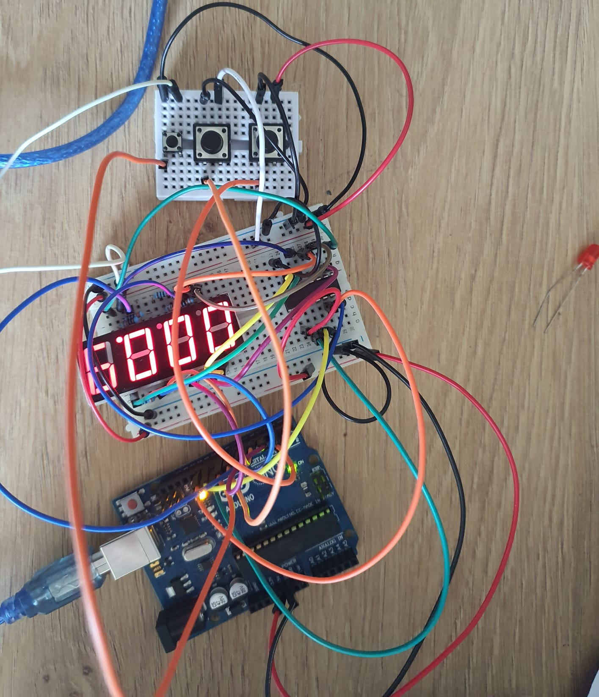
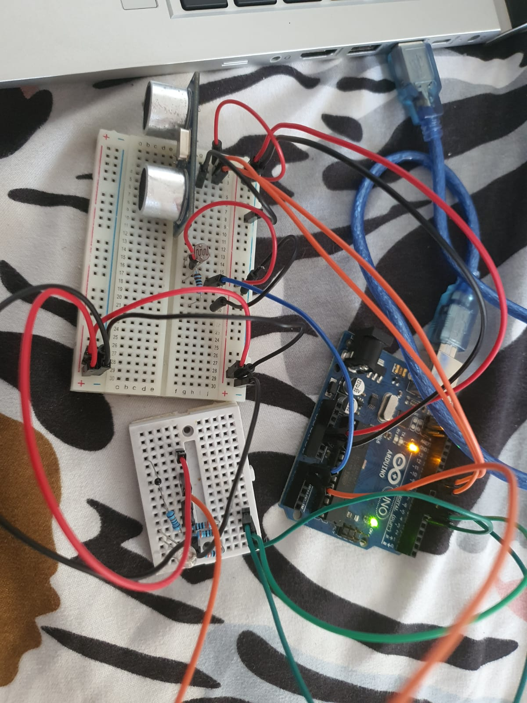
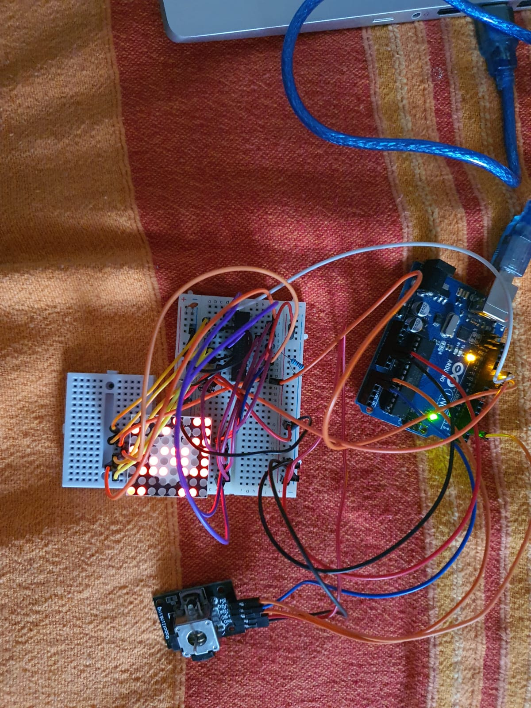
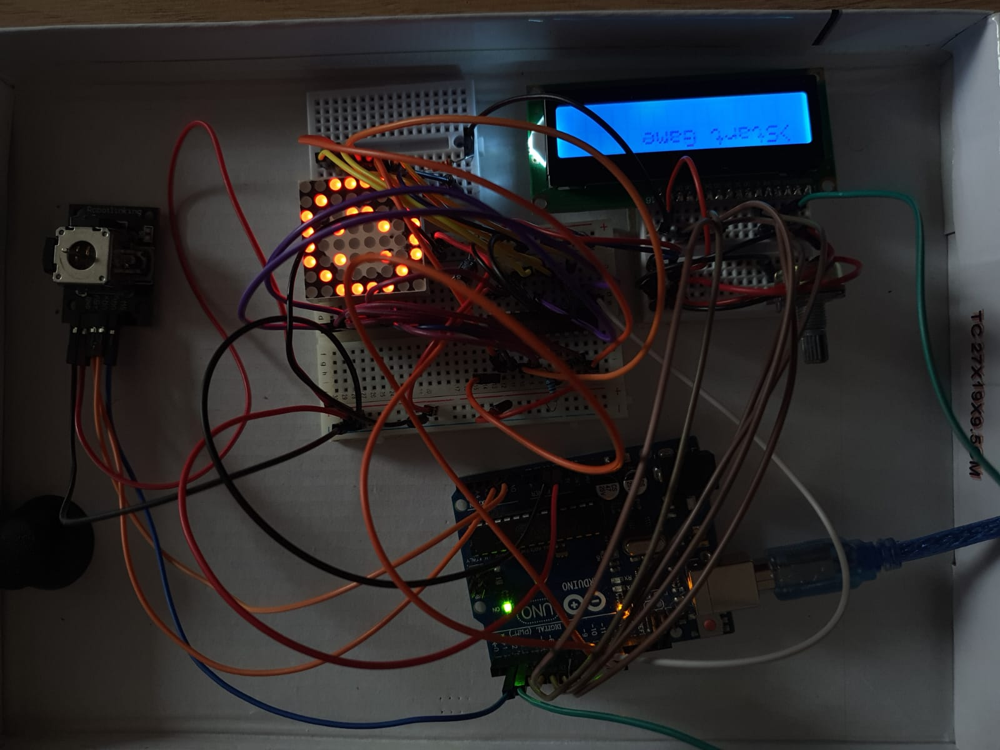

# Introduction to Robotics

## Descriere

Acest repository conține informații și temele de la robotică. Pentru teme vor fi adaugate mai multe informatii: 
- requirements
- detalii despre tema
- materiale foto/video
- cod

Mai jos veți găsi o mică glumă pentru a vă amuza!

## Glumă

Într-un bar se aduce un robot pe post de barman. Vine un client, se aşează la tejghea, robotul îi serveşte băutura şi îl întreabă:
– Ce IQ aveți?
– 150…
Și robotul continuă conversaţia despre fizica cuantică, tehnologii medicale avansate şi alte subiecte care necesită un grad ridicat de cunoştinţe şi înţelegere.  Impresionat, clientul iese din bar, stă două minute şi intră iar. La fel, îl preia robotul şi răspunde acestuia:
– 100…
Și robotul continuă discuţia despre celebre meciuri de box, renumite fabrici de bere şi altele de același tip uzual. Clientul mai încearcă o dată faza, iese afară, intră şi este întâmpinat de robot:
– Ce IQ aveți?
– 50…
– Și… tot fericit că l-ai votat pe Băsescu?

## Alte glume despre roboți

- Cum numești un robot care se lovește mereu de pereți?
  - Wall-E.
- Ce fac roboții câini?
  - Ei byte.
- Ce se întâmplă cu roboții după ce aceștia dispar?
  - Ruginesc în pace.
- Care este trupa preferată a unui robot?
  - Fețe metalice
- De ce a traversat puiul robot drumul?
  - El a fost programat așa.

## Homework 1

[Vizualizare ](https://youtu.be/1N3irRfwCFM)

### Components
- RGB LED (At least 1)
- Potentiometers (At least 3)
- Resistors and wires as needed

### Description
Use a separate potentiometer for controlling each color of the RGB LED: Red, Green, and Blue. This control must leverage digital electronics. Specifically, you need to read the potentiometer’s value with Arduino and then write a mapped value to the LED pins.

 

## Homework 2

[Vizualizare ](https://youtube.com/shorts/hmYTQVivXF4?feature=share)

### Components
-  LEDs (At least 4: 3 for the floors and 1 for the elevator’s operational
state)
- Buttons (At least 3 for floor calls)
- Buzzer (1) - optional for Computer Science, mandatory for CTI
- Resistors and wires as needed

### Description
Design  a  control  system  that  simulates  a  3-floor  elevator  using  the  Arduino platform.  

Here are the specific requirements:

• LED Indicators: Each of the 3 LEDs should represent one of the 3 floors.The LED corresponding to the current floor should light up.  Additionally,another LED should represent the elevator’s operational state.  It should blink when the elevator is moving and remain static when stationary.

• Buttons:Implement 3 buttons that represent the call buttons from the 3 floors.  When pressed, the elevator should simulate movement towards the floor after a short interval (2-3 seconds).

• Buzzer  (optional  for  Computer  Science,  mandatory  for  CTI):The buzzer should sound briefly during the following scenarios:
  – Elevator arriving at the desired floor (something resembling a ”cling”).
  – Elevator  doors  closing  and  movement  (pro  tip:  split  them  into  2different sounds)
  
• State Change & Timers:If the elevator is already at the desired floor,pressing the button for that floor should have no effect.  Otherwise, aftera button press, the elevator should ”wait for the doors to close” and then ”move”  to  the  corresponding  floor.   If  the  elevator  is  in  movement,  it should either do nothing or it should stack its decision (get to the firstprogrammed floor,  open the doors,  wait,  close them and then go to the next desired floor).

• Debounce:Remember to implement debounce for the buttons to avoidu intentional repeated button presses.

 

## Homework 3

[Vizualizare ](https://youtu.be/lr_9OH2ECP0)

### Components
-  1 7-segment display
-  1 joystick
-  resistors
-  wires (per logic)

### Description
You will use the joystick to control the position of the segment and ”draw” on the display. The movement between segments should be natural, meaning they should jump from the current position only to neighbors, but without passing through ”walls”.

The initial position should be on the DP. The current position always blinks (irrespective of the fact that the segment is on or off). Use the joystick to move from one position to neighbors (see table for corresponding movement). Short pressing the button toggles the segment state from ON to OFF or from OFF to ON. Long pressing the button resets the entire display by turning all the segments OFF and moving the current position to the decimal point. 

## Homework 4

[Vizualizare ](https://youtu.be/Q6xPuRTwS4w)

### Components
-  1 7-segment display
-  3 buttons
-  resistors
-  wires (per logic)

### Description
1. Display shows ”000.0”. When pressing the Start button, the timer should start.
2. During timer counter, each time you press the lap button, you should save that timer’s value in memory (not persistent, it is OK to be deleted upon reset), up to 4 laps (or more if you want); pressing the 5th time should override the 1st saved one. If you press the reset button while timer works, nothing happens. If you press the pause button, the timer stops.
3. In Pause Mode, the lap flag button doesn’t work anymore. Pressing the reset button resets you to 000.0
4. After reset, you can now press the flag buttons to cycle through the lap times. Each time you press the flag button, it takes you to the next saved lap. Pressing it continuously should cycle you through it continuously. Pressing the reset button while in this state resets all your flags and takes the timer back to ”000.0”

## Homework 5 - ”Smart Environment Monitor and Logger”

[Vizualizare ](https://youtu.be/PuZ1YfwFdWs)

### Components
-  Ultrasonic Sensor (HC-SR04)
-  LDR (Light-Dependent Resistor)
-  RGB LED
-  resistors
-  wires (per logic)
-   (Optional) Additional sensors

### Description
This Arduino-based project, titled "Smart Environment Monitor and Logger" is designed to gather and log environmental data using a variety of sensors. It aims to provide a hands-on approach to integrating sensor readings, memory management, serial communication, and menu-driven user interaction. This project is an excellent exploration into the world of embedded systems and IoT applications.

## Homework 6 - BomberMan version1

[Vizualizare ](https://youtu.be/vAg3sWAYmUs)

### Components
-  Joystick
-  8x8 LED Matrix
-  MAX7219
-  Resistors and capacitors as needed
-  Breadboard and connecting wires

### Description
There are 4 types of elements - player (blinks slowly), bombs (blinks fast), wall (doesn't blink) and reward (blinks very fast). The player moves from the joystick. By pressing the joystick button, a bomb will be planted which, after exploding, can erase a wall located either above, below, left or right. For the initial level, we have 6 bombs, if we use them all and do not reach the reward, we lose. After we use the last one, we have 10 seconds to reach the reward.

## Homework 7 - BomberMan version2

[Vizualizare ](https://youtu.be/p29qg4rfzMg)

### Components
-  Joystick
-  8x8 LED Matrix
-  MAX7219
-  Resistors and capacitors as needed
-  Breadboard and connecting wires
-  LCD

### Description
In version 1, I added an LCD and created an interactive menu. We are shown a message at the beginning, and after the menu. To scroll it, press up or down on the joystick. We have several categories. To select one of them, press the button on the joystick. During the game, information such as the player's name, the number of bombs he has left, the radius of a bomb and the level you have reached will be displayed. We can also set the intensity of the matrix and the LCD from Serial.Monitor

# Arduino Radar with Ultrasonic Sensor

### Components
- Arduino UNO
- Ultrasonic Sensor (HC-SR04)
- Servo Motor
- Breadboard
- Jump Wires
- Resistors (optional for voltage regulation)

### Description
This project demonstrates how to create a simple radar system using Arduino and an ultrasonic sensor. The ultrasonic sensor is used to detect objects in its path, and the data is visualized in real-time using a servo motor to emulate the radar sweeping motion. The project is an excellent way to understand how ultrasonic sensors work and can be utilized in practical applications such as distance measurement, obstacle avoidance, and automation systems.

### How It Works
- The ultrasonic sensor emits a high-frequency sound wave and waits for the echo.
- The time taken for the echo to return is calculated by the Arduino, which then translates this into distance.
- The servo motor rotates the sensor for a sweeping effect, and the distance data is visualized in a manner that resembles a radar screen.

### Demonstration 
[Vizualizare](https://youtu.be/JGPwgHwKcnw)

# Arduino Alarm System with Distance Sensor and Buzzer

### Components
- Arduino UNO
- Ultrasonic Distance Sensor (HC-SR04)
- Buzzer
- RGB LED
- Buttons (3x)
- Breadboard
- Jump Wires
- Resistors
- Optional: Enclosure Box

### Description
This project is an Arduino-based alarm system designed for door security. It utilizes an ultrasonic distance sensor to detect if someone is at the door. When the sensor detects a presence, the system activates a loud buzzer and flashes an RGB LED as an alert. The system is encased in a box for practical deployment at doors or entryways.

### Functionality
- **Detection**: The ultrasonic sensor monitors the distance in front of the door. If it detects an object within a predefined range (e.g., less than 2 meters), it triggers the alarm.
- **Alarm**: Upon detection, the buzzer emits a loud sound, and the RGB LED starts flashing rapidly, serving as a visual and auditory warning.
- **Secret Button Combination**: The alarm can be deactivated by pressing three buttons in a specific sequence. This acts as a 'secret code' for the system.
- **Incorrect Attempts**: If the wrong button sequence is entered, the alarm's intensity increases, making it louder and more noticeable.

### Usage
This alarm system is ideal for home security, especially for doors or sensitive areas. The loud buzzer and flashing LED provide a strong deterrent against unauthorized entry, while the secret button combination ensures that only authorized individuals can deactivate the system.

### Demonstration
[Vizualizare](https://youtu.be/skfQAR9B2vw)

# Arduino Sequence Memory Game

### Components
- Arduino UNO
- LEDs (4x)
- Resistors for LEDs
- Push Buttons (4x)
- Buzzer
- RGB LED
- Breadboard
- Jump Wires

### Description
This Arduino project is a sequence memory game inspired by "Simon Says". It challenges players to memorize and replicate random light sequences. The game uses four distinct LEDs, each associated with a corresponding button. Players must press the buttons in the order that the LEDs light up.

### Gameplay
1. **Sequence Display**: The game begins by displaying a random sequence using the four LEDs.
2. **Player Response**: The player must replicate the sequence by pressing the buttons in the correct order.
3. **Correct Sequence**: If the player successfully replicates the sequence, the buzzer makes a positive sound, and the RGB LED turns green. Then, a new, slightly longer sequence is displayed.
4. **Incorrect Sequence**: If the player presses the buttons in the wrong order, the buzzer emits a negative sound, and the RGB LED turns red. The game then displays a new sequence.

### Demonstration
[Vizualizare](https://youtu.be/mTO6zZ78T38)

